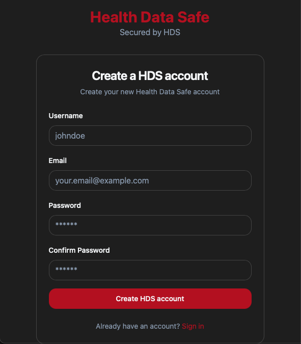
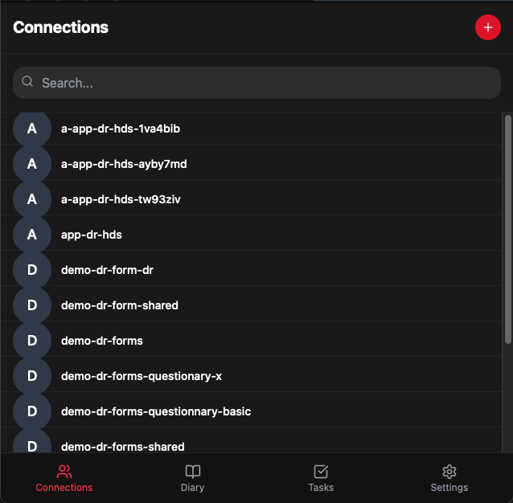
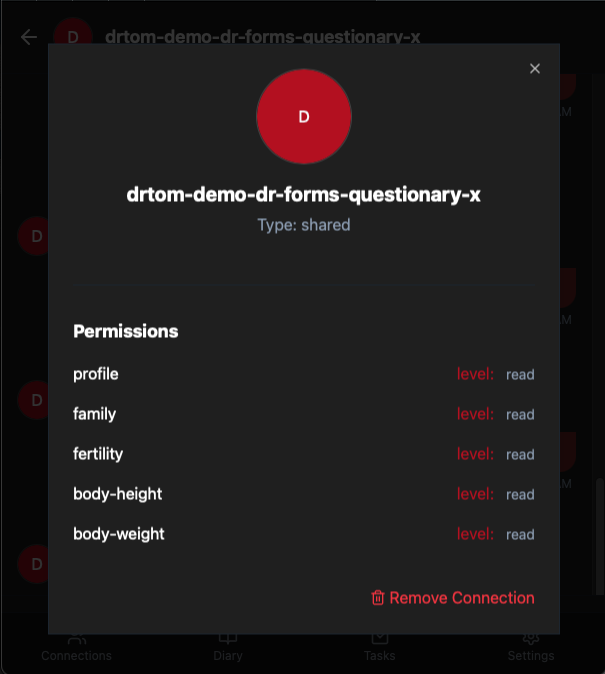
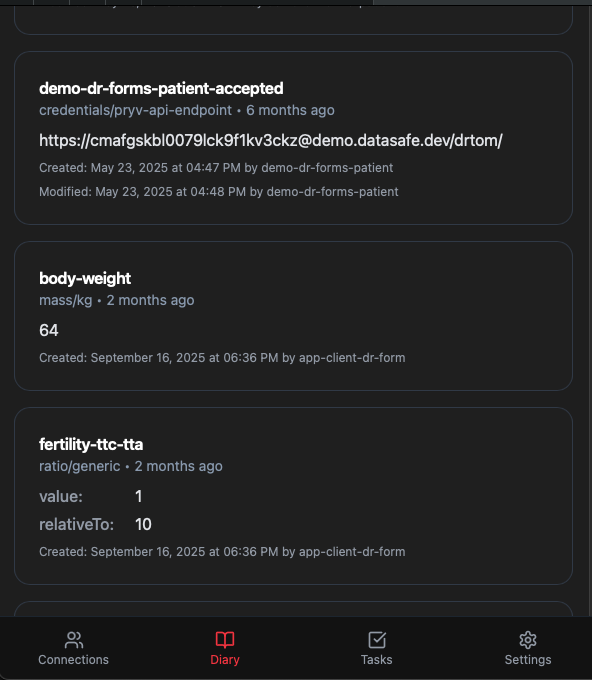
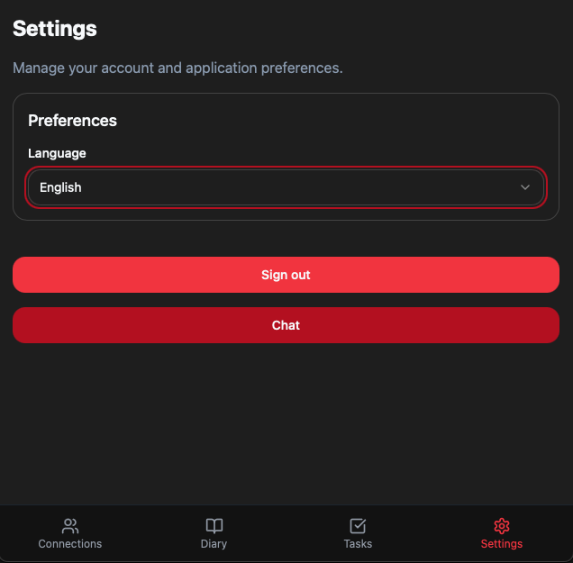

# HDS Web app

Prototype, of what the Patient could look like

Published on: [demo-app.datasafe.dev](demo-app.datasafe.dev)

#### Currently covered features

- Sign & Register
- Connection list (raw) 
- Connection authorizations and consent display
- Diary (shows raw last event) - Live (refresh on new events)
- Multilingual
- Signout 

### Todos

- Use [hds-lib-js](https://github.com/healthdatasafe/hds-lib-js) instead of pryv-lib
  - First step done, still the app is using Pryv Connection's logic and not yet Collectors
- Better display of connections
- Better display of diary based on hds-lib 
- ⚠️ [USE CASES & MOCKUPS](docs/README.md)

## Dev 

- Setup dev environment with `./scripts/setup.sh`
  - it will checkout `gh-pages` branch in `./dist` for publishing

-  start development with: `npm run devb`

## Todos

## Screenshots

Of current implementation

### Login

### Register

### Connections List

List of current connections

### Connection conversation

Content of data from this connection (for now fake data)

### Conversation details

Authorizations and eventual consent message for this connection

### Diary

Latest data for this account

### Settings

