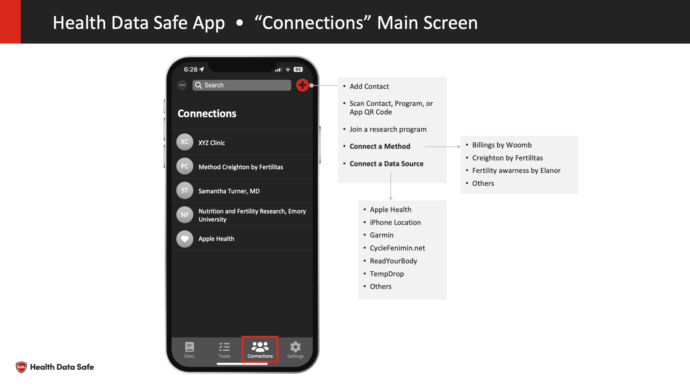
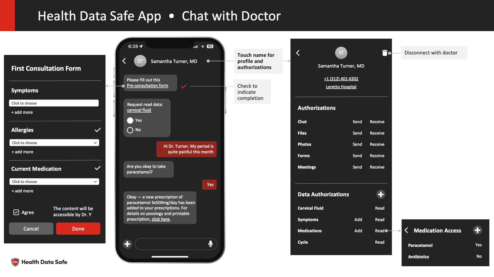
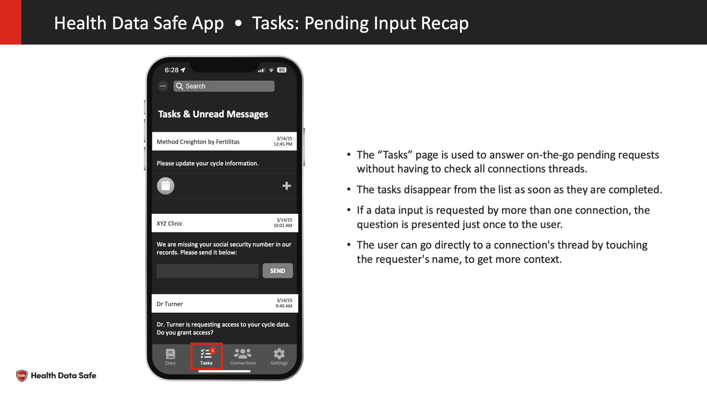

## **APP HDS (For Patients)**

A mobile app with the usual aspect of a “chat” application. Exchange with Dr / Clinics / Researcher / Mentors / Groups of interest are accessible by listing current discussions and selecting. 

#### In the chat discussions

A chat discussion can be  “read only” when, for example, the user subscribes to a channel of information.

- standard messages can be exchanged,
- forms (request for input)  like on what’s app 
- documents 

Sharing data is accessible by the settings of the discussion, the patient can check and visualize which data is shared from any discussion.  

#### **Features**

- Register
- Sign-in
- Settings
- Data Input 
- Discussion & community 
  - Discussions within the same community, for example, a Dr associated with a clinic should be attached to the same community

### **Mockups**

##### Connections main screen

##### Diary

##### Chat with clinic

##### Chat with Dr

##### Connection on boarding

##### Chat with Program Research ... 

##### Tasks

## **Use cases for patient**

### **Use case on filling a questionnaire** 

### **Use Case onboarding a clinic**

1. The patient is invited to install the App and register to HDS (this could be on a web site)
2. The patient is given a link, by email or a QR code to join the clinic “Discussion” (this can be prior to step1 .. to lead the patient to the App or a WebSite) 
3. In the clinic “discussion,” there is a welcoming message that invites the patient to fill a welcoming form. 
   1. If some information is already on HDS, (name, phone, etc... the form is pre-filled, the patient can check the information)
   2. During the process, the patient can communicate with the clinic using the chat. 
   3. The discussion should also be used to set-up and confirm appointments.
   4. The discussion can also be used to request consent from the clinic to access some data “streams” of the patient. ( read / write )
4. A dedicated discussion can be engaged with a Dr following the same format  for a pre-consultation
   1. Messaging (chat) with the doctor would be enabled by the Dr and is availability or not visible 

During this process Data input is mostly done by filling forms requested in chats

### **Use Case self-tracking and following a program**

A program (visible on HDS but owned by the manufacturer, ie a clinic, or a company)  the  is a recurring machine-based logic that requests data input from the patient. 

1. The patient joins a “program,” for example, “Creighton by xyz” either on an invitation coming from the clinic channel or choosing within a set of publicly available programs. 
2. After validating the initial consent and onboarding form (optional) the patient receives a regular request for data (forms) in the chat to be filled. 
3. If allowed by the program, the patient may input discrete data when needed. 
4. If the patient is following programs that share similar inputs, the patient does not have to fill it twice. The value will be shared with other programs. 
5. The program may send notifications to the patient regarding the program
   1. Ex: we didn’t receive your latest period information, are you late? or you want to discard this input?
      1. Depending on this answer, an appropriate response 
   2. Based on the last information you sent, During the next xx days you should be fertile with an accuracy of xx%

A super simple example could be a program that requests the picture (photo) of the Creighton Charting Paper every 4 weeks. 

- An evolution would be to trigger the request when the woman complete with the data of her last menstruation. 

### **Use Case, checking all pending inputs in a single place** 

“Aggregated view of pending requests for input.”

This feature and use case is an optional evolution of the app. To minimize time to fill forms and enter data. The patient may have a view of “pending” request from all discussions and fill them one (discard) in a single “view” of the app. 

### **Use Case connecting a source of data (device, app, ..)**

To automatically fill requests for input, some data may be collected automatically (ex from connected wearables or Apple health). 

Like joining a program, connecting a source of data can be done by a link or from a list of publicly available sources. 

1. When joining a data source, the user may have to enter credentials (ex.. Withings) or validate agreements apple (health) 
2. In the discussion new data points should be visible as they are created. 
3. Dedicated visualizations should be developed to avoid a too-large number of data points.
   1. For geolocation 
   2. Activities 
   3. .... 

Exemple: Entering the information regarding the last period would complete the request for input for the various programs. 

### **Use Case: View data as graph, map** 

One of the challenges in designing the app will be to have user-friendly ways of visualizing data. 

#### **On a mobile device:**

- We should consider, first to provide “single” views.. for example:
  - for geolocation data, only a map for a “selectable” by “week”, “month”, “women cycle”, “year” 
  - for temperatures only a graph for a determined “selectable” by .... 
  - ... 

### **On a web application:**

- On the web a more advanced visualization of data may be developed to enable the association of different values on the same graph. 

## **Use cases for a clinic**

HDS should propose a web application allowing the following. 

### **Manage care givers and operator of the HDS platform**

- The App should provide a full set of tools to define Access Control Groups and Rules 
- This may be based on an existing technology to be determined. 
- In a best-case scenario, HDS should interface with the clinic existing Access Control System

### **On board a new patient**

- The operator prepares or selects an onboarding “package” of questions and information for the patient
- The operator a “unique invitation” link (could be QR code) to the patient
  - The invitation link should contain the “identifier” of the patient in the clinical system 
  - see: Use case onboarding a clinic (patient)

### **Receives a message from the patient**

The operator(s) should be able to interact with the patient to answer questions and manage meetings. 

- On the UI of the operator, there is the ability to send and receive messages from patients. 